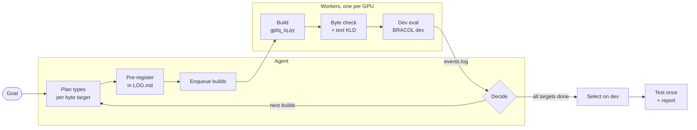

# Agentic GGUF quantization

Give an AI agent (Claude Code) one goal; it runs the quantization loop by itself until every size target has a file,
then selects, tests and reports. Built on stock [llama.cpp](https://github.com/ggml-org/llama.cpp) (`9a7570587`);
outputs are ordinary GGUF files.

## Prerequisites

Linux with NVIDIA GPUs (the loop uses GNU `stat` / `sed`, `flock`, `nvidia-smi`; the quantizer loads `libggml-base.so`).

```bash
git clone https://github.com/ggml-org/llama.cpp && cd llama.cpp && git checkout 9a7570587ce908b0073a0458877205b80627f393
cmake -B build -DGGML_CUDA=ON && cmake --build build -j && cd ..
pip install -r agentic-quantization/requirements.txt         # Python 3.11; gguf comes from llama.cpp/gguf-py
```

## Start

```bash
cd agentic-quantization
cp loop/env.example.sh loop/env.sh   # set paths
claude
```
> Quantize Qwen3.5-2B to fit LM + Q8_0 mmproj under 1 GB, and beat the public GGUFs on BRACOL dev. Use GPUs 0–3.

The agent does the one-time setup itself (skill `gguf-quant-loop`, step 1): BF16 GGUF and Q8_0 mmproj
(`convert_hf_to_gguf.py`), the BF16 dev reference run, the text-KLD base, then `loop/start_workers.sh`.
More requests: [`example-run/prompts.md`](example-run/prompts.md).

## The loop



## Layout

| Path | What |
|---|---|
| `CLAUDE.md` (= `AGENTS.md`) | agent rules |
| `.claude/skills/gguf-quant-loop/` | loop procedure, commands, lessons |
| `loop/` | workers, queue, event wait, status; `env.example.sh` lists every setting |
| `quantizer/gptq_iq.py` | GPTQ with llama.cpp rounding and image + text calibration |
| `quantizer/plan_alloc.py`, `retype_template.py` | per-tensor type plan for a byte budget, template GGUF |
| `quantizer/fileinfo.py`, `ggml_quant.py` | bytes, bpw, SHA-256 of a GGUF; ctypes binding to `libggml-base.so` |
| `quantizer/gguf_transplant.py` | optional: copy named tensors between two builds; not used for any file in `selection/` |
| `benchmark/` | evaluation harness, queues, collection ([`benchmark/README.md`](benchmark/README.md)) |
| `protocol/` | frozen prompt and chat templates ([`protocol/README.md`](protocol/README.md)) |
| `manifest.csv` | BRACOL split: 419 dev / 1,266 test (`benchmark/make_manifest.py`) |
| `manifest_jmuben.csv` | JMuBEN test set, 2,184 images (`benchmark/make_manifest_jmuben.py`) |
| `data/` | label map, class counts, public GGUF log (repo, revision, SHA-256; `local_path` relative to `$HN04B_PUBLIC`) |
| `selection/` | every built file and the dev-selected picks ([`selection/README.md`](selection/README.md)) |
| `results/` | quantization scores ([`results/README.md`](results/README.md)) |
| `example-run/` | logs of the real run (2026-10-04) |

## Method

1. **Types:** start from an Unsloth GGUF, move tensors up/down to fit the byte budget.
2. **Values:** GPTQ with llama.cpp's own rounding (`ggml_quantize_chunk`), error carried across blocks.
3. **Calibration:** text + images through the vision tower: generic COCO (*ours-general*) or BRACOL dev (*ours-task*).
4. **Selection:** on dev, by a rule written before any test run.

`llama-quantize --imatrix` can produce the same types and bytes; it lacks the error correction and image calibration.
`results/summary.md` compares ours with the public files at matched bytes, which measures allocation, calibration and
rounding together. At identical types (2B, Unsloth UD-IQ2_XXS types, 768 MB) our quantizer with generic calibration
(`general3`) reached A100 dev F1 0.331 against Unsloth's 0.309, so the quantizer alone adds little; the gain at 768 MB comes
from the allocation ([`example-run/logs/4090-benchmark-LOG.md`](example-run/logs/4090-benchmark-LOG.md)).

The released base `Qwen3.5-2B-coffee-base-Q2.gguf` is `Qwen3.5-2B-ours-task-1GBpkg-eQ2_K.gguf` in `selection/` (SHA-256 `cb88d42f…`).

## Reproduce

The code, manifests, prompt and file hashes are here; model files are not (`.gitignore`). Inputs:

| Input | Source |
|---|---|
| BRACOL images (`$BRACOL_ROOT`) | Hugging Face `luisangelico/bracol` at a pinned revision ([`benchmark/README.md`](benchmark/README.md)) |
| BRACOL dev images by file name (`$WORK/bracol/dev512`, for ours-task) | `python ../fine-tuning/data/prep_images.py bracol` |
| Public GGUFs (`$HN04B_PUBLIC`) | `benchmark/fetch_public.py`; revisions and SHA-256 in `data/public_gguf_log.csv` |
| Text calibration (`$CALIB_TEXT`) | FineWeb-Edu + C4, 128 × 2048 tokens (256 × 2048 for the superseded text-only `general` builds); the run's text file is not published |
| COCO calibration (ours-general) | first 400 COCO val2017 images by file name, 512 px JPEG q90, with a generic captioning (`general2`) or scene multiple-choice (`general3`) prompt; the run's manifest and prompts are not published |
| Text-KLD check (`$WIKITEXT`) | wikitext-2 raw, test split |

The unpublished calibration assets were a private archive during the run (`example-run/logs/a100-quantization-LOG.md`).
A rebuild with your own text and COCO files follows the same procedure but will not give byte-identical GGUFs.
Testing every file as in `results/`: [`benchmark/README.md`](benchmark/README.md), "Full benchmark".
